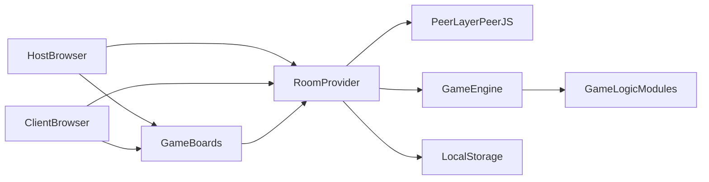
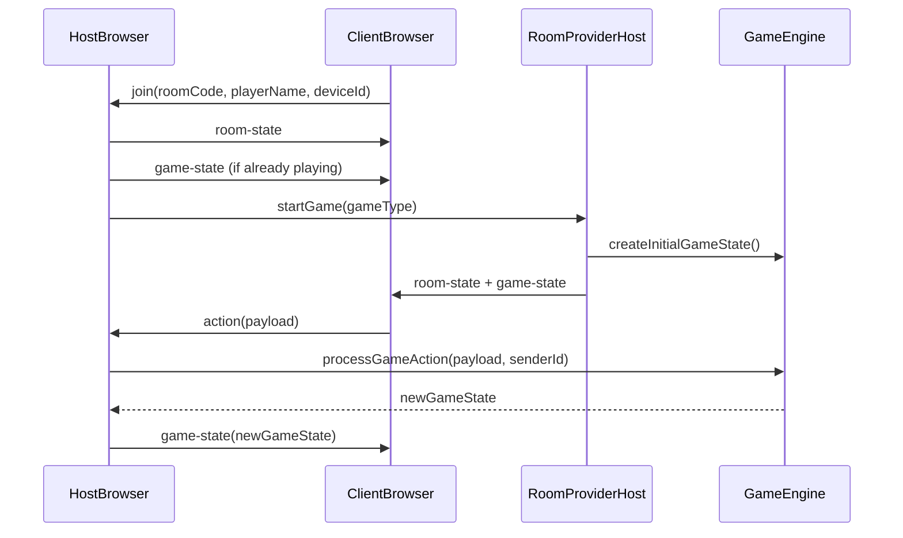

# Cam's Favourite Games

A browser-based multiplayer game suite built with React, TypeScript, Vite, and PeerJS.

This project runs fully peer-to-peer in the browser: one player hosts a lobby and acts as the authoritative game server, while other players connect directly using a 4-character room code.

## Games included

Current game types (from `src/games/gameCatalog.ts` and `src/networking/types.ts`):

- `yahtzee` (1-4 players)
- `hearts` (4 players, target score options 50 or 100)
- `battleship` (2 players)
- `liars-dice` (2-4 players)
- `poker` (2-8 players)
- `up-and-down-the-river` (4 players)

## Key features

- Host-authoritative multiplayer state sync over WebRTC (PeerJS)
- No dedicated backend required for gameplay state
- Room code join flow (`ABCD` format -> `cfg-ABCD` peer IDs)
- Bot players with host-side delayed turn scheduling
- Reconnect flow with exponential backoff and grace-period disconnect handling
- GitHub Pages deployment via GitHub Actions on push to `master`

## Architecture

### High-level system view



### Runtime message flow



### Core design invariants

- Host is always the source of truth for room and game state.
- Clients never mutate authoritative state directly; they send actions.
- Game logic is isolated per game module and orchestrated through `src/games/gameEngine.ts`.
- Bots run on the host side and follow the same action pipeline as humans.

## How the project works

### App shell and routing

- Entry point: `src/main.tsx`
- Root providers + routes: `src/App.tsx`
- Routes:
  - `/` -> `src/pages/Home.tsx`
  - `/game/:roomCode` -> `src/pages/GamePage.tsx`

### Lobby and game lifecycle

1. User lands on `Home`.
2. If no name in localStorage, a prompt is shown (`playerName`, `playerColor`).
3. Host creates lobby (`createLobby`) with generated room code.
4. Clients join using room code (`joinRoom`).
5. Host selects game and starts (`startGame`).
6. Clients and host transition to `GamePage`.
7. During play, actions are processed by host and broadcast as full game-state snapshots.
8. Non-poker games transition to `finished`, then host can return to lobby and wins are tracked.

### Networking model

Main files:

- `src/networking/roomStore.tsx` (state authority and orchestration)
- `src/networking/peer.ts` (PeerJS setup/connect/destroy)
- `src/networking/types.ts` (shared network contracts)
- `src/utils/roomCode.ts` (room code and peer ID mapping)
- `src/utils/deviceId.ts` (persistent device identity)

Important message types:

- Client -> host: `join`, `action`, `leave`
- Host -> client: `room-state`, `game-state`, `error`, `host-disconnected`

Reconnect behavior:

- Clients attempt reconnect with backoff (1s, 2s, 4s).
- Host applies a 15s grace period before marking players disconnected.
- Rejoining clients can receive in-progress `game-state` immediately.

## Project structure

```text
src/
  components/        # Shared UI components
  games/             # Game catalog, engine, and per-game modules
  networking/        # Peer/network state and messaging
  pages/             # Route-level pages (Home/GamePage)
  utils/             # Device ID and room code helpers
```

## Local development

### Prerequisites

- Node.js 20+ recommended
- npm

### Install and run

```bash
npm install
npm run dev
```

### Quality checks and production build

```bash
npm run lint
npm run build
npm run preview
```

Scripts are defined in `package.json`:

- `dev`: run Vite dev server
- `build`: `tsc -b && vite build`
- `lint`: ESLint over project files
- `preview`: serve built app locally

### Local troubleshooting

- If joining fails, verify room code format is 4 chars and host is online.
- If connections time out, refresh both host/client tabs and recreate lobby.
- If identity behavior seems odd, inspect localStorage keys: `deviceId`, `playerName`, `playerColor`.

## Build and deployment

Build stack:

- Vite + React (`vite.config.ts`)
- TypeScript project references (`tsconfig.app.json`, `tsconfig.node.json`)
- ESLint flat config (`eslint.config.js`)
- Tailwind v4 via Vite plugin

Deployment:

- Workflow: `.github/workflows/deploy.yml`
- Trigger: push to `master` (or manual workflow dispatch)
- CI steps:
  1. `npm ci`
  2. `npm run build`
  3. Upload `dist/` artifact
  4. Deploy to GitHub Pages

## Adding a new game

Use this checklist when extending the platform.

1. Add type in `src/networking/types.ts`
   - Extend `GameType` union.
   - Add any new game-start options if needed.
2. Add catalog entry in `src/games/gameCatalog.ts`
   - Provide title, player constraints, descriptions, and rules/how-to-play text.
3. Create game module folder `src/games/<game-name>/`
   - `types.ts`
   - `logic.ts`
   - `<GameName>Board.tsx`
   - (optional) `rules.ts`
4. Wire game into `src/games/gameEngine.ts`
   - `createInitialGameState`
   - `processGameAction`
   - `checkGameOver`
   - `runSingleBotTurn`
   - `getGameWinners`
5. Render board in `src/pages/GamePage.tsx`
6. Add selectable game to `src/pages/Home.tsx`

### Conventions to follow

- Treat game state as immutable.
- Invalid actions should return unchanged state.
- Validate current player before applying an action.
- Keep bot logic idempotent and host-driven.
- Keep engine-level interfaces generic (`unknown`) and cast inside game modules.

## Contributor playbook

Use this map to find where changes should go quickly:

- UI styling/layout tweaks -> `src/components/*`, `src/pages/*`, `src/index.css`
- Lobby/network behavior -> `src/networking/roomStore.tsx`, `src/networking/peer.ts`
- Game rule bugs/features -> `src/games/<game>/logic.ts` and `src/games/<game>/types.ts`
- Cross-game orchestration -> `src/games/gameEngine.ts`
- Game discoverability/info -> `src/games/gameCatalog.ts`

Recommended implementation workflow:

1. Identify whether change is UI-only, game-specific logic, or networking.
2. Keep host-authoritative data flow intact (clients send actions only).
3. Run `npm run lint` and `npm run build`.
4. If changing a game, manually test at least one host + one client browser flow.

## Tech stack

- React 19
- TypeScript 5
- Vite 7
- PeerJS
- Tailwind CSS v4
- Framer Motion
