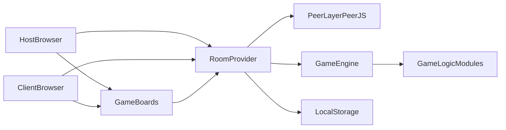
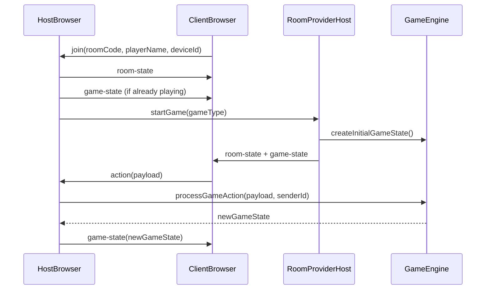

# Cam's Favourite Games

A browser-based multiplayer game suite built with React, TypeScript, Vite, and PeerJS.

This project runs fully peer-to-peer in the browser: one player hosts a lobby and acts as the authoritative game server, while other players connect directly using a 4-character room code.

## Games included

Current game types (from `src/games/registry.ts` and `src/networking/types.ts`):

- `cucumber` (3-7 players; avoid the last trick, elimination at 30 penalty points)
- `pong` (2-12 players)
- `cribbage` (2-4 players; target score 61 or 121)
- `mobilization` (4-6 players)
- `casino` (2-4 players; optional `casinoMatchLength` in start options: `to11`, `to21`, or `eachDealerOnce` — default `to21`)
- `yahtzee` (1-4 players)
- `farkle` (2-6 players; target score 3000, 5000, or 10000)
- `hearts` (4-5 players; target score 50 or 100)
- `poker` (2-8 players)
- `up-and-down-the-river` (4-6 players; start order `up-down` or `down-up`)
- `twelve` (2-4 players; UI title **Tolva** — table piles, pile count 3-6)
- `settler` (3-4 players)
- `cross-crib` (2 or 4 players only)

**Production** home page and game picker use `PRODUCTION_GAME_TYPES` in `registry.ts` (see that file for the current ordered list).

## Key features

- Host-authoritative multiplayer state sync over WebRTC (PeerJS)
- No dedicated backend required for gameplay state
- Room code join flow (`ABCD` format -> `cfg-ABCD` peer IDs)
- Bot players with host-side delayed turn scheduling
- Reconnect flow with exponential backoff and grace-period disconnect handling
- GitHub Pages deployment via GitHub Actions on push to `master`

## Architecture

### High-level system view


```mermaid
flowchart LR
  browserHost[HostBrowser]
  browserClient[ClientBrowser]
  roomProvider[RoomProvider]
  peerLayer[PeerLayerPeerJS]
  gameEngine[GameEngine]
  gameBoards[GameBoards]
  gameLogic[GameLogicModules]
  localStorage[LocalStorage]

  browserHost --> roomProvider
  browserClient --> roomProvider
  roomProvider --> peerLayer
  roomProvider --> gameEngine
  gameEngine --> gameLogic
  browserHost --> gameBoards
  browserClient --> gameBoards
  gameBoards --> roomProvider
  roomProvider --> localStorage
```

### Runtime message flow


```mermaid
sequenceDiagram
  participant host as HostBrowser
  participant client as ClientBrowser
  participant room as RoomProviderHost
  participant engine as GameEngine

  client->>host: join(roomCode, playerName, deviceId)
  host->>client: room-state
  host->>client: game-state (if already playing)
  host->>room: startGame(gameType)
  room->>engine: createInitialGameState()
  room->>client: room-state + game-state
  client->>host: action(payload)
  host->>engine: processGameAction(payload, senderId)
  engine-->>host: newGameState
  host->>client: game-state(newGameState)
```

### Core design invariants

- Host is always the source of truth for room and game state.
- Clients never mutate authoritative state directly; they send actions.
- Game logic is isolated per game module and orchestrated through `src/games/gameEngine.ts`, which dispatches via `src/games/registry.ts`.
- Bots run on the host side and follow the same action pipeline as humans.

### Radial deal animation

Eight card games with a radial seat layout (local player at the bottom) play a **client-side dealing animation** at round setup. Cards fly face-down from a center stack to each destination; the local hand fills in sorted order as cards arrive at the bottom seat. Table and pile cards show empty placeholders first, then reveal one at a time when each flight lands. **Table/extra cards are always dealt before hand cards.**

The animation is cosmetic and local to each browser — authoritative state arrives from the host immediately, and boards gate visibility until each card "lands." The host pauses bot turns and auto-advances for a deterministic duration (`dealTiming.ts`) so gameplay does not start mid-deal.

| Module | Role |
|--------|------|
| `src/games/shared/useDealAnimation.ts` | Plans flights, reveal timers, `isDealing` / `revealedFor` / `isExtraRevealed` |
| `src/games/shared/DealAnimationLayer.tsx` | Center stack + framer-motion flying card backs |
| `src/games/shared/dealTiming.ts` | Shared timing used by boards and `roomStore` deal hold |
| `src/networking/roomStore.tsx` (`getRoundDealInfo`) | Host-side hold until animation duration elapses |

Games: Hearts, Casino (4 table slots on first deal), Cross Crib (starter), Tolva/Twelve (front piles), Cribbage, Up and Down the River, Mobilization, Poker (hole cards only), **Cucumber**. Respects `prefers-reduced-motion`.

See [`src/games/shared/README.md`](src/games/shared/README.md) for integration details, per-game `dealKey` values, and a checklist for wiring new boards.

## How the project works

### App shell and routing

- Entry point: `src/main.tsx`
- Root providers + routes: `src/App.tsx`
- Routes:
  - `/` -> `src/pages/Home.tsx`
  - `/game/:roomCode` -> `src/pages/GamePage.tsx`

### Lobby and game lifecycle

1. User lands on `Home`.
2. If no name in localStorage, a prompt is shown (`playerName`, `playerColor`).
3. Host creates lobby (`createLobby`) with generated room code.
4. Clients join using room code (`joinRoom`).
5. Host selects game and starts (`startGame`).
6. Clients and host transition to `GamePage`.
7. During play, actions are processed by host and broadcast as full game-state snapshots.
8. Non-poker games transition to `finished`, then host can return to lobby and wins are tracked.

### Networking model

Main files:

- `src/networking/roomStore.tsx` (state authority and orchestration)
- `src/networking/peer.ts` (PeerJS setup/connect/destroy)
- `src/networking/types.ts` (shared network contracts)
- `src/utils/roomCode.ts` (room code and peer ID mapping)
- `src/utils/deviceId.ts` (persistent device identity)

Important message types:

- Client -> host: `join`, `update-profile`, `action`, `leave`, `ready`
- Host -> client: `room-state`, `game-state`, `error`, `kicked`, `host-disconnected`

Reconnect behavior:

- Clients attempt reconnect with backoff (1s, 2s, 4s).
- Host applies a 15s grace period before marking players disconnected.
- Rejoining clients can receive in-progress `game-state` immediately.

## Project structure

```text
src/
  components/        # Shared UI components
  games/             # Game registry, engine, and per-game modules
    registry.ts      # Single source of truth for all game definitions
    gameEngine.ts    # Orchestrates logic via registry lookups
    shared/          # Cross-board utilities (deal animation, seat name fit, etc.)
    <game-name>/     # Per-game types, logic, board, and optional options/HUD
  networking/        # Peer/network state and messaging
  pages/             # Route-level pages (Home/GamePage)
  utils/             # Device ID and room code helpers
```

## Local development

### Prerequisites

- Node.js 20+ recommended
- npm

### Install and run

```bash
npm install
npm run dev
```

### Quality checks and production build

```bash
npm run lint
npm run typecheck
npm run test
npm run test:watch
npm run test:e2e
npm run build
npm run preview
```

Scripts are defined in `package.json`:

- `dev`: run Vite dev server
- `build`: `tsc -b && vite build`
- `lint`: ESLint over project files
- `typecheck`: TypeScript project reference checks without emit
- `test`: run Vitest unit/component suites
- `test:watch`: run Vitest in watch mode
- `test:coverage`: run Vitest with coverage output
- `test:e2e`: run Playwright smoke tests
- `preview`: serve built app locally
- `ci`: run lint, typecheck, unit tests, and build locally (does not run Playwright; use `npm run test:e2e` for that)

### Local troubleshooting

- If joining fails, verify room code format is 4 chars and host is online.
- If connections time out, refresh both host/client tabs and recreate lobby.
- If identity behavior seems odd, inspect localStorage keys: `deviceId`, `playerName`, `playerColor`.

## Build and deployment

Build stack:

- Vite + React (`vite.config.ts`)
- TypeScript project references (`tsconfig.app.json`, `tsconfig.node.json`)
- ESLint flat config (`eslint.config.js`)
- Tailwind v4 via Vite plugin

Deployment:

- Validation workflow: `.github/workflows/ci.yml`
  - Triggers on pull requests and pushes to `master`
  - Parallel jobs: lint + typecheck, unit tests (`vitest run`), production build, Playwright smoke tests (Chromium)
- Deployment workflow: `.github/workflows/deploy.yml`
  - Triggers on push to `master` (or manual workflow dispatch)
  - Builds and deploys `dist/` to GitHub Pages

## Adding a new game

Use this checklist when extending the platform. The game registry centralizes discoverability and engine dispatch, but several other files must stay in sync.

### 1. Add type (`src/networking/types.ts`)

- Extend the `GameType` union with your game key (e.g. `'my-game'`).
- Add any new game-start options to `GameStartOptions` if needed.

### 2. Create game module (`src/games/<game-name>/`)

| File | Required | Purpose |
|------|----------|---------|
| `types.ts` | yes | State, action, and player types |
| `logic.ts` | yes | Five exports (see below) |
| `<GameName>Board.tsx` | yes | React board; props match `BoardProps` in `registry.ts` |
| `rules.ts` | recommended | Pure validation helpers (keeps `logic.ts` readable) |
| `logic.test.ts` | recommended | Rule and reducer tests |
| `*Options.tsx` | optional | Lobby start options panel |
| `*TitleExtra.tsx` / `*ToolbarExtra.tsx` | optional | Extra HUD content below the title |

**Required logic exports** (wired through `GameDefinition`):

```ts
createXState(players: Player[], options?: GameStartOptions): unknown
processXAction(state: unknown, action: unknown, playerId: string): unknown
isXOver(state: unknown): boolean
runXBotTurn(state: unknown): unknown
getXWinners(state: unknown): string[]
```

**Logic conventions:**

- Treat state as **immutable**; invalid actions return **unchanged state** (never throw).
- Validate the acting player inside `processAction`.
- `runBotTurn` performs **one** bot action per call; the host loops in `roomStore`.
- Keep engine-facing types as `unknown`; cast inside your module.

### 3. Register the game (`src/games/registry.ts`)

Add one entry to `GAME_REGISTRY` with:

- Metadata: `title`, `shortDescription`, `playersLabel`, `minPlayers`, `maxPlayers`
- Optional `allowedPlayerCounts` when only specific totals are valid (e.g. cross-crib: 2 or 4 only — not every integer in the min–max range)
- `info`: `{ goal, rules[], howToPlay[] }` for the homepage info modal
- `theme`: Tailwind classes for homepage card and lobby panel
- Logic functions + `Board` (+ optional `OptionsPanel`, `TitleExtra`, `ToolbarExtra`)
- Flags: `fullBoard`, `hasHandZoom`, `production`, `showNewBadge`, `hudTitleLines`, `hideHudTitleDuringPlay`

Also append your key to **`ALL_GAME_TYPES`** (display order + contract tests). If shipping on the homepage, add to **`PRODUCTION_GAME_TYPES`**.

TypeScript requires **every** `GameType` to have a `GAME_REGISTRY` entry — missing either side fails the build.

### 4. Wire host behavior (`src/networking/roomStore.tsx`)

The registry alone does **not** schedule bots or deal holds. For most new games you must add:

| Location | When needed |
|----------|-------------|
| `getRoundDealInfo()` | Radial deal animation — return `{ signature, cardCount }` matching the board's `dealKey` and total dealt cards |
| Bot scheduler block (~`scheduleBotTurns` effect) | Bots, delayed auto-advances, trick resolution pauses |
| `applyProfileToGameState()` | Player rename / color change mid-game |

Search for an existing similar game (e.g. `up-and-down-the-river`, `hearts`, `cucumber`) and mirror its block.

### 5. Tests and verification

These run automatically once the game is registered:

- `src/games/registry.contract.test.ts` — required handlers exist; unknown actions do not throw
- `src/games/gameEngine.test.ts` — `runSingleBotTurn` does not throw

Add game-specific coverage in `src/games/<game-name>/logic.test.ts`.

Run before finishing:

```bash
npm run lint && npm run typecheck && npm run test && npm run build
```

### Reference implementations by shape

| Game shape | Copy from |
|------------|-----------|
| Radial trick-taking (play → pause → resolve trick) | `up-and-down-the-river/`, `hearts/`, **`cucumber/`** |
| Radial seats + deal animation wiring | `UpAndDownTheRiverBoard.tsx`, `CucumberBoard.tsx` |
| Seat pill / trick slot layout (3–7 players) | `.river-*` classes in `index.css`; extend `TRICK_SLOT_PLACEMENTS` per player count |
| Turn-based with phases | `mobilization/`, `twelve/` |
| Real-time / non-card | `pong/` |

### Trick-taking pattern (Hearts / Up River / Cucumber)

Many card games split **playing a card** from **resolving a completed trick** so the UI can animate:

1. `play-card` — append to `currentTrick`; when the trick is full, set `trickWinner` but **do not** clear the trick yet.
2. Host scheduler — after `TRICK_DISPLAY_DELAY`, call `processAction` with `{ type: 'resolve-trick' }` and an **empty** `playerId`.
3. `resolve-trick` — award the trick, advance leader, or end the hand/round.
4. Optional `{ type: 'start-next-hand' }` / `{ type: 'start-next-round' }` — host-only, also with empty `playerId`, often after a hand-end delay.

Boards dispatch only player actions (`play-card`, bids, etc.). Never call resolve/advance actions from the client UI.

### HUD title (top-left during play)

- Set `hudTitleLines: ['My', 'Game']` for a multi-line title on `GamePage`.
- **`hideHudTitleDuringPlay: true`** hides the title until `isOver(state)` — omit this flag (or set `false`) if the title should stay visible during play, like Casino or Cucumber.
- `TitleExtra` renders **below** the title (scores, round info).

### Radial deal animation

If your board uses `useDealAnimation`:

1. Board: stable `dealKey`, `DealAnimationLayer`, gate hand on `deal.revealedFor`, disable actions while `deal.isDealing`.
2. `roomStore.getRoundDealInfo`: same signature string and total card count as the board.
3. See [`src/games/shared/README.md`](src/games/shared/README.md).

### Styling

- Reuse existing board CSS where possible (e.g. Cucumber reuses `.river-*` for cards, seats, and trick grid).
- Add game-specific overrides under a `.my-game-*` prefix in `src/index.css`.
- Seat pills often use a colored name row + white value row; see `.river-seatPillTop` and `.river-seatCell--*` for the Up River pattern.

### New game badge

When you launch a new game, highlight it on the homepage with an amber **New** ribbon:

1. Set `showNewBadge: true` on that game's `GAME_REGISTRY` entry.
2. Remove `showNewBadge` from any other game — **only one** game should wear the badge at a time.

No other changes needed: `GameCard` reads the flag; sheen animation is in `src/index.css` (`.new-badge-text-sheen`).

### Common pitfalls (for AI agents)

1. **Forgetting `ALL_GAME_TYPES`** — game builds but never appears in tests/homepage order.
2. **Forgetting `roomStore` bot scheduler** — bots never play, or tricks never resolve after animation.
3. **`getRoundDealInfo` mismatch** — bots start before the deal animation finishes.
4. **Calling resolve/advance from the board** — must be host-scheduled with empty `playerId`.
5. **Setting `hideHudTitleDuringPlay` by default** — title disappears during play unless that is intentional.
6. **Sparse player counts** — use `allowedPlayerCounts: [2, 4]`, not just `minPlayers`/`maxPlayers`.
7. **No `logic.test.ts`** — contract tests pass but game rules are untested.

## Contributor playbook

Use this map to find where changes should go quickly:

- UI styling/layout tweaks -> `src/components/*`, `src/pages/*`, `src/index.css`
- Lobby/network behavior -> `src/networking/roomStore.tsx`, `src/networking/peer.ts`
- Game rule bugs/features -> `src/games/<game>/logic.ts` and `src/games/<game>/types.ts`
- Cross-game orchestration -> `src/games/gameEngine.ts`
- Game metadata, themes, and discoverability -> `src/games/registry.ts`
- Radial deal animation -> `src/games/shared/useDealAnimation.ts`, `DealAnimationLayer.tsx`, `dealTiming.ts`, and per-board wiring; host hold in `roomStore.tsx` (`getRoundDealInfo`)
- Host bot scheduling and delayed auto-advances -> `roomStore.tsx` (search for your `gameType` or copy from a similar game)

Recommended implementation workflow:

1. Identify whether change is UI-only, game-specific logic, or networking.
2. Keep host-authoritative data flow intact (clients send actions only).
3. Run `npm run lint` and `npm run build`.
4. If changing a game, manually test at least one host + one client browser flow.

## Tech stack

- React 19
- React Router 7
- TypeScript 5
- Vite 7
- PeerJS
- Tailwind CSS v4
- Framer Motion
- Lucide React (icons)
