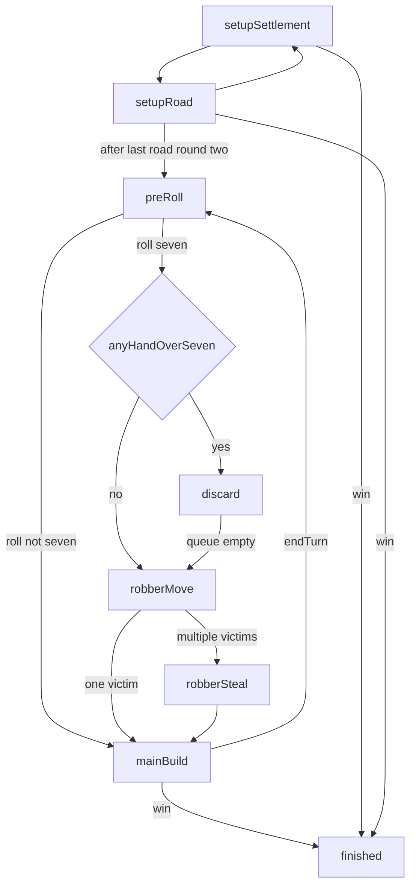

# Settler (implementation guide)

This folder implements a Catan-style settlers game for this repo. It is **developer documentation**: player-facing rules and tips live in [`src/games/registry.ts`](../registry.ts) under `settler.info`.

## Module map

| File | Role |
|------|------|
| [`types.ts`](./types.ts) | Domain types: `SettlerState`, `Phase`, `SettlerAction`, resources, costs, dev deck shape |
| [`layout.ts`](./layout.ts) | Static board geometry: 19-hex axial disc, `DEFAULT_BOARD_GRAPH`, vertices/edges, SVG `viewBox` helpers (no rules) |
| [`logic.ts`](./logic.ts) | Rules engine: `createSettlerState`, `processSettlerAction`, production, robber, dev cards, bots; exported legality for UI |
| [`SettlerBoard.tsx`](./SettlerBoard.tsx) | View: renders `SettlerState`, dispatches `SettlerAction` via `onAction` |
| [`logic.test.ts`](./logic.test.ts) | Tests against pure logic |

## Design philosophy and architecture

- **Single source of truth** — Every authoritative state change goes through `processSettlerAction` in `logic.ts`. It behaves like a reducer: validate phase and actor, then return an immutably updated `SettlerState`. Invalid actions return the previous state (no throw).

- **Separation of concerns** — `layout.ts` owns only geometry (hex/vertex/edge ids and pixel layout). `logic.ts` owns legality and economy, including the **bank**: finite supply per resource type, withdrawals when hexes produce, deposits when players pay costs or discard. `SettlerBoard.tsx` maps state to SVG, highlights, and captions, and turns clicks into action payloads.

- **UI is mostly stateless** — Game truth lives in `SettlerState`. React `useState` in the board is reserved for local UX: e.g. `buildTap` (which build mode is armed), discard slot selection, maritime trade popup, dice animation bookkeeping.

- **Host integration** — The generic game shell registers Settler in [`src/games/registry.ts`](../registry.ts) with `createSettlerStateFromPlayers`, `processSettlerActionUnknown`, and `Board: SettlerBoard`. Board props use `state` and `onAction` typed as `unknown` at the registry boundary; `SettlerBoard` casts them to `SettlerState` and concrete actions so the host stays decoupled from this game’s types.

## Phase machine

The `Phase` union in `types.ts` drives both the rules engine and the UI (highlights, captions, who may act):

- **`setup-settlement` / `setup-road`** — Each player places one settlement then one road touching that settlement, for two rounds in **snake order** (`setupRound`, `setupOrderIndex`, synced via `setupCurrentPlayerSlot`). After the second settlement in round 2, starting resources are granted (`grantSecondSettlementResources` in `logic.ts`).

- **`pre-roll`** — Current player must roll (`roll` action).

- **On a 7** — `buildDiscardState` runs. Anyone with more than 7 cards must discard half (rounded down), in **table order** (`discardQueue` / `discardRequired`). If nobody must discard, the game goes straight to **`robber-move`**. Otherwise **`discard`** until the queue is empty, then **`robber-move`**. After the robber lands: if several adjacent opponents have cards, **`robber-steal`** lets the roller pick; if exactly one victim, steal is automatic. Then **`main-build`**.

- **On a non-7 roll** — Production runs from the bank into hands, then **`main-build`** (build, trade, dev cards, end turn).

- **`main-build`** — Active player may build, maritime trade (4:1), buy/play dev cards (subject to “one dev card played per turn” and “cards bought this turn not playable until next turn”), place free roads from Road Building, then **`end-turn`**, which advances `currentPlayerIndex`, clears dice and production snapshots, clears `newDevCards` for the player who ended, and returns to **`pre-roll`**.

- **`finished`** — Game over; `winnerIds` set when someone reaches `VP_TO_WIN` (10).

## Actions and legality

The UI should only emit `SettlerAction` variants defined in `types.ts`:

| Action | Typical use |
|--------|-------------|
| `place-settlement` / `place-road` | Setup |
| `roll` | `pre-roll` |
| `discard` | `discard` phase |
| `move-robber` | `robber-move` |
| `steal-from` | `robber-steal` |
| `build-road` / `build-settlement` / `build-city` | `main-build` (paid builds) |
| `place-free-road` / `skip-free-road` | Road Building follow-up |
| `maritime-trade` | 4:1 with bank (`main-build`) |
| `buy-dev-card` / `play-knight` / `play-road-building` / `play-year-of-plenty` / `play-monopoly` | Dev cards |
| `end-turn` | End of `main-build` |

**Actor rules** — For `discard`, the valid actor is `discardQueue[0]`, not necessarily `currentPlayerIndex`. For all other actions handled in the main switch, the actor must be the current player (`players[currentPlayerIndex]`). See `processSettlerAction` in `logic.ts`.

**Highlights** — Use `getLegalSettlementVertices` and `getLegalRoadEdgesForPlayer` (exported from `logic.ts`) so the board matches engine legality for buttons and click targets.

## UI setup

- **SVG board** — Uses `DEFAULT_BOARD_GRAPH` from `layout.ts`: hex terrain and number tokens, robber position, interactive vertices and edges. What is clickable and how it is styled follows `phase`, `myId`, and the legality helpers above.

- **Sidebar** — Player strip (VP, colors), turn dice slot (`SettlerTurnDiceSlot`: “Roll dice” in `pre-roll` for the local player when it is their turn; 3D dice after values exist). Resource hand renders physical card slots; in `discard`, slots toggle into the `discard` payload. Action log, dev-card chips/buttons, maritime trade controls, and build buttons with cost tooltips live alongside.

- **Main-phase building** — Build buttons set `buildTap` to `road` / `settlement` / `city`; the next legal click on the graph sends the corresponding `build-*` action. Setup uses direct `place-settlement` / `place-road` without that mode.

## Pointers

- Victory threshold and costs: `VP_TO_WIN`, `COSTS`, `DEV_CARD_COST` in `types.ts`.
- Bots: `runSettlerBotTurn` in `logic.ts` (wired through the registry).
- Tests target `logic.ts`, not React components.
