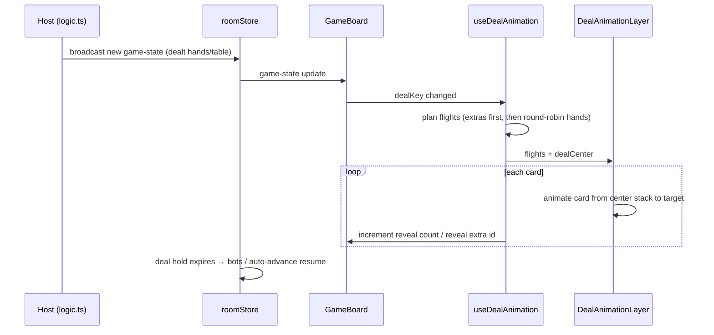

# Shared game UI utilities

Cross-game helpers used by multiple board components.

## Radial deal animation

At the start of each round where cards are dealt to hands (and sometimes to the table), radial-seat card games play a **local, client-side** dealing animation. Face-down cards fly one at a time from a stack at the table center to each destination. The animation is cosmetic only: authoritative game state arrives from the host immediately; boards gate what is visible until each card's flight "lands."

### Games covered

These boards use the deal animation (all use a radial seat layout with the local player at the bottom):

| Game | Board | `dealKey` | Hand cards | Table / extra targets |
|------|-------|-----------|------------|------------------------|
| Hearts | `HeartsBoard.tsx` | `roundNumber` | All hands | — |
| Casino | `CasinoBoard.tsx` | `roundNumber-dealNumberInRound` | All hands | 4 center table slots (first deal of round only) |
| Cross Crib | `CrossCribBoard.tsx` | `roundNumber` | All hands | Center grid starter card |
| Tolva (Twelve) | `TwelveBoard.tsx` | `roundNumber` | All hands | Per-seat front piles (bottom + top) |
| Cribbage | `CribbageBoard.tsx` | `dealerIndex` | All hands | — (starter cut happens later) |
| Up and Down the River | `UpAndDownTheRiverBoard.tsx` | `roundIndex` | All hands | — (trump lives in toolbar) |
| Mobilization | `MobilizationBoard.tsx` | `roundIndex` | All hands | — |
| Poker | `PokerBoard.tsx` | `handNumber` | Hole cards only | — (community cards are mid-hand) |
| Cucumber | `CucumberBoard.tsx` | `handNumber` | All hands (active players only) | — |
| Golf | `GolfBoard.tsx` | `holeNumber` | — | Six table slots per seat |

### Module layout

```text
src/games/shared/
  useDealAnimation.ts   # Hook: flight planning, reveal timers, deal state
  DealAnimationLayer.tsx # Overlay: center stack + flying card backs
  dealTiming.ts         # Shared timing constants (board + host scheduler)
```

Styles live in `src/index.css` (`.deal-animLayer`, `.deal-animStack`, `.deal-animCard`). Flying cards reuse Tolva's `.twelve-cardBackFace` back design.

### How it works



1. **Trigger** — Each board passes a `dealKey` string that changes exactly when a fresh deal occurs (e.g. round number). When `dealKey` changes, the hook resets and starts a new animation.
2. **Coordinates** — `boardRef` and `tableRef` provide layout bounds. Seat and extra targets are percentage positions (`seatLeft`, `seatTop`) on the table, converted to board-relative pixels (same approach as Tolva's card-toss).
3. **Deal order** — **Table/extra cards are dealt first**, one flight per extra target, in array order. Then hand cards are dealt **round-robin** across seats until each seat's `count` is satisfied.
4. **Flying cards** — `DealAnimationLayer` renders a depleting center stack and framer-motion flights. Each flight has a staggered `delay` so cards leave the stack one at a time.
5. **Reveal gating** — When a flight arrives (`delay + flightDuration`):
   - Hand cards increment `revealCounts[playerId]`. Boards call `deal.revealedFor(myId, fullCount)` to slice the local hand and grow the spread width as cards appear (sorted order unchanged).
   - Table/extra cards set `revealedExtras[extraId]`. Boards call `deal.isExtraRevealed(id)` to swap placeholders for real cards one at a time.
6. **Cleanup** — After the last flight finishes, `isDealing` becomes false and the overlay is removed. Full game state is shown.

### Hook API

```ts
const deal = useDealAnimation({
  boardRef,
  tableRef,
  dealKey: String(state.roundNumber),
  seats: [{ playerId, isSelf, seatLeft, seatTop, count }],
  extraTargets: [{ id, seatLeft, seatTop, faceUp? }], // optional
});

deal.isDealing;                          // true while animation is active
deal.flights;                            // for DealAnimationLayer
deal.dealCenter;                         // stack origin point
deal.revealedFor(playerId, fallback);    // hand cards visible so far
deal.isExtraRevealed(extraId);           // table/extra card landed (true when not dealing)
```

Boards should:

- Attach `ref={boardRef}` on the outer board wrapper (`position: relative`).
- Attach `ref={tableRef}` on the table element used for seat percentages.
- Render `<DealAnimationLayer flights={...} dealCenter={...} remaining={...} />`.
- Gate local hand rendering on `revealedFor`.
- Gate table/extra slots on `isExtraRevealed` and show **empty placeholders** while dealing.
- Disable player actions while `deal.isDealing` where applicable (bids, plays, etc.).
- Skip hand entrance stagger animations during dealing (cards appear as they are revealed).

### Extra targets and placeholders

Games that deal to the table or piles pass `extraTargets` with stable `id` strings. Each board maps those ids to its own placeholder UI:

- **Casino** — `casino-table-0` … `casino-table-3` → empty `casino-tableSlot` divs until revealed (only when `dealNumberInRound === 1`).
- **Cross Crib** — `crosscrib-starter` → center cell keeps `crosscrib-slotPlaceholder` until the starter lands.
- **Tolva** — `{playerId}-pile-{pileIndex}-bottom` / `-top` → `twelve-pilePlaceholder` until each pile card lands.

### Timing and host synchronization

`dealTiming.ts` defines constants shared by the animation and the host's turn scheduler:

- `DEAL_FLIGHT_DURATION_MS` (520) — single-card flight time
- `DEAL_TOTAL_DEAL_MS` (2400) — target total deal duration (adaptive step clamped between min/max)
- `dealAnimationDurationMs(cardCount)` — deterministic total duration for `cardCount` flights

In `roomStore.tsx`, `getRoundDealInfo()` mirrors each board's `dealKey` and total animated card count (hands + extras). When a new deal signature is detected, the host sets a **deal hold** so bot turns and auto-advances wait until `dealAnimationDurationMs(cardCount)` has elapsed. This keeps gameplay from starting mid-animation even though the animation itself is not networked.

When adding deal animation to a new radial game, update `getRoundDealInfo()` with a matching signature and card count.

### Accessibility

If the user has `prefers-reduced-motion: reduce`, the hook skips animation (`isDealing` stays false) and boards show the full dealt state immediately. CSS hides `.deal-animLayer` in that case.

### Adding deal animation to a new radial board

1. Build `seats` from existing `seatLayouts` and dealt hand lengths.
2. Choose a `dealKey` that changes on every fresh deal and nowhere else.
3. Add `extraTargets` if the round setup deals to table slots or piles; deal those ids in a stable order.
4. Wire reveal gating and placeholders as above.
5. Add a case to `getRoundDealInfo()` in `roomStore.tsx` with the same signature and total card count.
